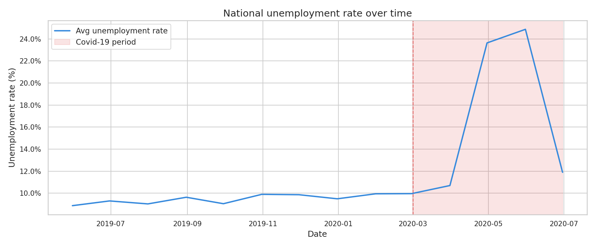
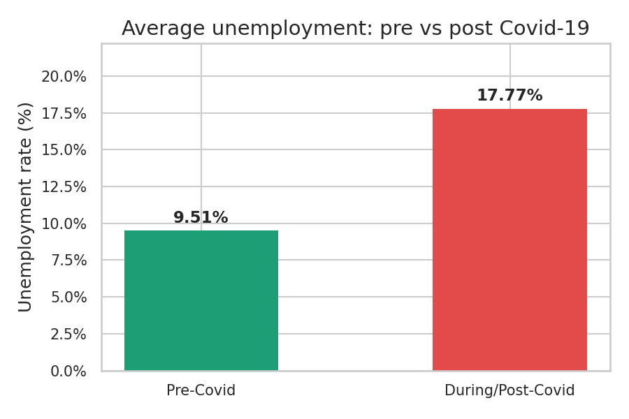
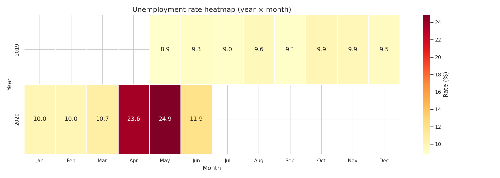

# 📉 Unemployment Analysis with Python

> **CodeAlpha Data Science Internship — Task 2**

## 📌 Overview
This project analyzes **unemployment trends in India** using real-world data,
with a focus on uncovering the devastating impact of **Covid-19** on employment rates.
Insights are presented through clean, interactive visualizations.

## 📊 Key Statistics
| Metric | Value |
|--------|-------|
| Pre-Covid avg unemployment | 9.51% |
| Covid-19 impact | +8.26 percentage points |
| Post-Covid avg unemployment | 17.77% |
| Peak unemployment rate | 76.74% |
| Peak recorded | April 2020 |
| Hardest-hit region | Tripura (28.35%) |
| Lowest-unemployment region | Meghalaya (4.80%) |
| Overall avg unemployment rate | 11.79% |

## 🔍 Key Insights
- 📈 Unemployment spiked sharply after March 2020 due to Covid-19 lockdowns
- 🗺️ Urban regions were hit harder than rural areas during the pandemic
- 📅 Seasonal trends show higher unemployment in certain months
- 📉 Labour participation rate dropped simultaneously with rising unemployment
- 🔄 Recovery began gradually from mid-2020 onwards

---

---

---

## 📷 Visualizations

---

## 🛠 Libraries Used
- `Pandas` — data cleaning & manipulation
- `Matplotlib` — trend and bar charts
- `Seaborn` — heatmap and styled plots
- `NumPy` — numerical computations

---

## 👤 Author
**Samuel Okoosi**
CodeAlpha Data Science Intern
[LinkedIn Profile](https://linkedin.com/in/thesamokoosi) • [GitHub](https://github.com/thesamokoosi)

